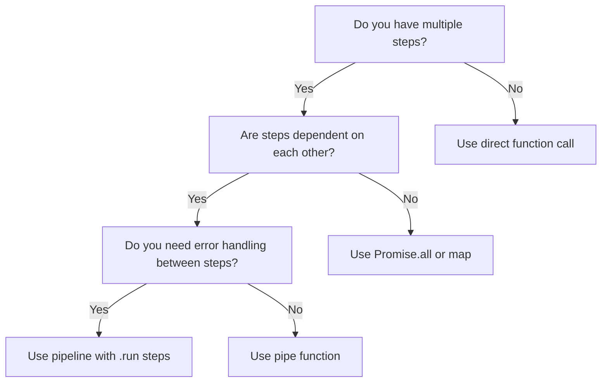
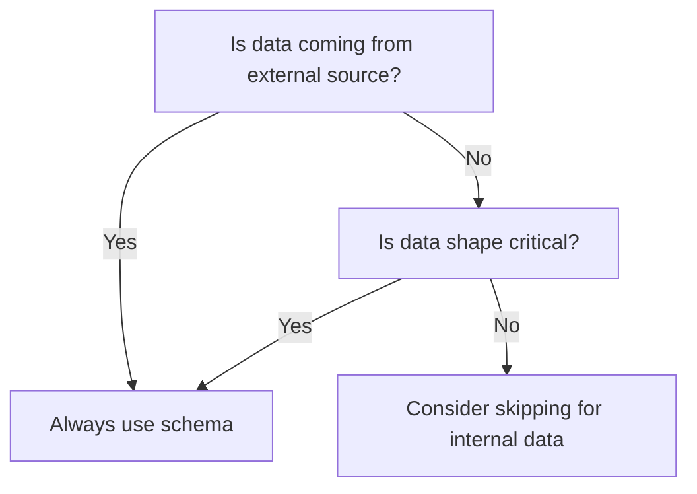
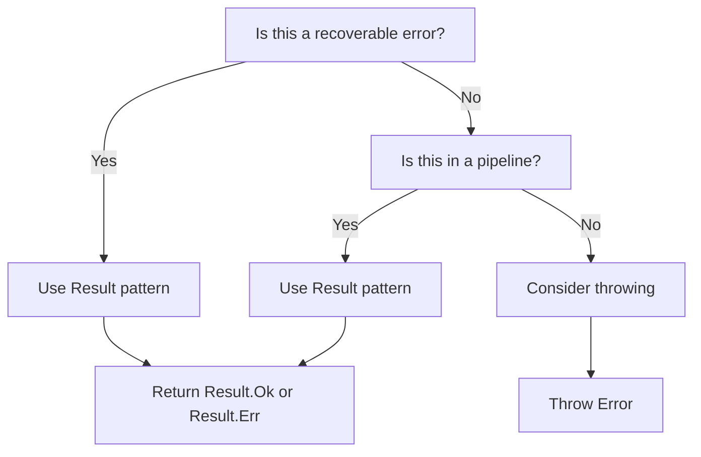
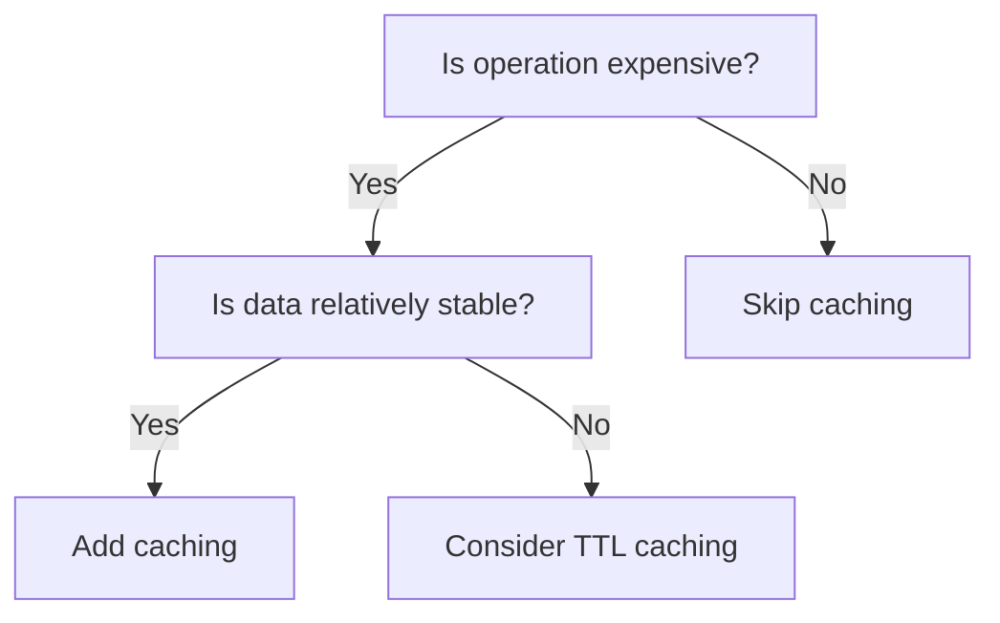
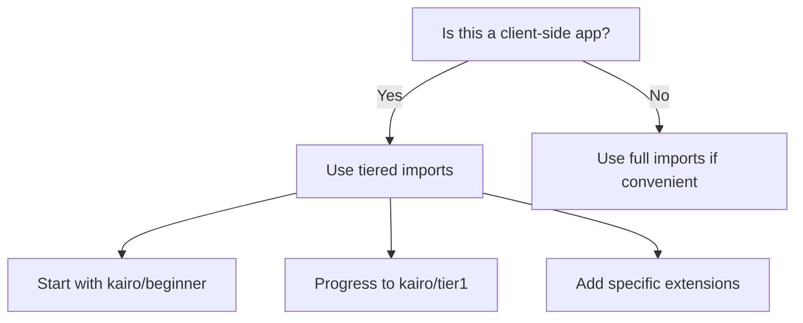

# Kairo Decision Tree

**Choose the right Kairo pattern for your specific situation.**

## 🎯 Start Here: What Are You Building?

### 📊 Data Processing
**You have data that needs validation, transformation, or business logic applied**

#### Simple Data Transformation
```
Input → Transform → Output
```
**Use**: `pipeline` + `map`
```typescript
const processUser = pipeline('process-user')
  .input(UserSchema)
  .map(user => ({ ...user, displayName: user.name.toUpperCase() }))
```
👉 **Examples**: [Data transformation patterns](./data-transformations)

#### Complex Business Logic
```
Input → Validate Rules → Transform → Validate Again → Output
```
**Use**: `pipeline` + `rules` + `map`
```typescript
const processRegistration = pipeline('registration')
  .input(RegistrationSchema)
  .validateAllRules(registrationRules)
  .map(data => transformUserData(data))
```
👉 **Examples**: [Business rules patterns](./business-rules)

#### Multi-Step Workflow
```
Input → Step 1 → Step 2 → Step 3 → Final Output
```
**Use**: `pipeline` with multiple `.run()` steps
```typescript
const workflow = pipeline('complex-workflow')
  .input(InputSchema)
  .run(step1Handler)
  .run(step2Handler)
  .run(step3Handler)
```
👉 **Examples**: [Workflow patterns](./workflows)

---

### 🌐 API Integration
**You need to call external services or APIs**

#### Single API Call
```
Input → API Call → Handle Response
```
**Use**: `resource`
```typescript
const UserAPI = resource('users', {
  get: {
    method: 'GET',
    path: '/users/:id',
    params: schema.object({ id: schema.string() }),
    response: UserSchema
  }
})
```
👉 **Guide**: [Building APIs](../getting-started/building-apis)

#### Multiple Related API Calls
```
Input → API Call 1 → API Call 2 → Combine Results
```
**Use**: `pipeline` + `resource`
```typescript
const getUserProfile = pipeline('user-profile')
  .input(schema.object({ userId: schema.string() }))
  .run(async ({ userId }) => {
    const user = await UserAPI.get.run({ id: userId })
    const posts = await PostAPI.listByUser.run({ userId })
    return { user: user.value, posts: posts.value }
  })
```
👉 **Examples**: [API integration patterns](./enterprise-integration)

#### API with Error Recovery
```
Input → Try Primary API → If Fails, Try Fallback → Handle All Errors
```
**Use**: `pipeline` with `.recover()`
```typescript
const resilientAPICall = pipeline('resilient-api')
  .input(InputSchema)
  .run(primaryApiCall)
  .recover(fallbackApiCall)
```
👉 **Examples**: [Resilient API patterns](../production-ready/resilient-apis)

---

### 💾 Data Storage
**You need to persist, retrieve, or manage data**

#### Simple CRUD Operations
```
Create → Store
Query → Retrieve
Update → Store
Delete → Remove
```
**Use**: `repository`
```typescript
const userRepo = repository('users', {
  schema: UserSchema,
  storage: 'memory'
})
```
👉 **Guide**: [Managing Data](../getting-started/managing-data)

#### Related Data (Foreign Keys)
```
User → has many → Posts
Post → belongs to → User
```
**Use**: `repository` + `hasMany`, `belongsTo`, `hasOne`
```typescript
const userRepo = repository('users', {
  schema: UserSchema,
  relationships: {
    posts: hasMany('posts', 'userId', PostSchema)
  }
})
```
👉 **Examples**: [Repository patterns](./repository-patterns)

#### Complex Data Operations
```
Validate → Transform → Store → Update Related → Send Events
```
**Use**: `pipeline` + `repository` + events
```typescript
const createUserWorkflow = pipeline('create-user')
  .input(CreateUserSchema)
  .validateAllRules(userRules)
  .run(async (userData) => {
    const user = await userRepo.create(userData)
    await profileRepo.create({ userId: user.id })
    await eventBus.publish(new UserCreatedEvent(user))
    return user
  })
```
👉 **Examples**: [Event-driven patterns](./event-driven-architecture)

---

## 🤔 Decision Points

### "Should I use pipeline or direct function calls?"



**Use `pipeline` when**:
- Multiple sequential steps
- Error handling between steps
- Need to validate input/output
- Want clear traceability

**Use `pipe` when**:
- Simple function composition
- No error handling needed
- Synchronous transformations

**Use direct calls when**:
- Single operation
- No composition needed

### "Should I use schema validation?"



**Always use schemas for**:
- API responses
- User input
- Configuration files
- Database records

**Consider skipping for**:
- Internal function parameters (use TypeScript types)
- Simple transformations
- Performance-critical paths (measure first!)

### "Should I use Result pattern or throw exceptions?"



**Use Result pattern for**:
- Validation errors
- Network failures
- Business rule violations
- Expected failures

**Use exceptions for**:
- Programming errors
- System failures
- Unexpected conditions

## 🚀 Performance Considerations

### "Should I add caching?"



**Add caching for**:
- API calls
- Database queries  
- Complex calculations
- File system operations

**Cache TTL guidelines**:
- User data: 5-15 minutes
- Configuration: 1-24 hours
- Static content: 24+ hours
- Calculations: Based on input change frequency

### "Should I optimize bundle size?"



**Tiered import strategy**:
```typescript
// Beginner (15KB) - Start here
import { Result, schema, pipeline } from 'kairo/beginner'

// Essential (25KB) - Most apps
import { Result, schema, resource, repository } from 'kairo/essential'

// Tier 1 (35KB) - Production apps
import { pipeline, rules, cache } from 'kairo/tier1'

// Specific features (add as needed)
import { events } from 'kairo/extensions/events'
import { transactions } from 'kairo/extensions/transactions'
```

## 📋 Quick Decision Matrix

| Scenario | Pattern | Import Level | Example |
|----------|---------|--------------|---------|
| Validate form data | `schema` + `rules` | Essential | [Form validation](./common-patterns#form-validation) |
| Call REST API | `resource` | Essential | [API calls](./common-patterns#api-calls) |
| Transform data | `pipeline` + `map` | Beginner | [Data transform](./common-patterns#data-transform) |
| Store with relationships | `repository` + relations | Tier 1 | [Data storage](./common-patterns#data-storage) |
| Multi-step business logic | `pipeline` + `rules` | Tier 1 | [Business logic](./common-patterns#business-logic) |
| Error recovery | `pipeline` + `.recover()` | Tier 1 | [Error handling](./common-patterns#error-handling) |
| Event-driven workflow | `events` + `workflow` | Extensions | [Event patterns](./event-driven-architecture) |
| Database transactions | `transactions` | Extensions | [Transaction patterns](../examples/workflows) |

## 🎯 Next Steps

Based on your decision, jump to the relevant guide:

### Getting Started
- 🌱 **[Your First App](../getting-started/your-first-app)** - If you chose basic patterns
- ⚡ **[Building APIs](../getting-started/building-apis)** - If you need API integration
- 💾 **[Managing Data](../getting-started/managing-data)** - If you need data storage

### Advanced Patterns
- 🏢 **[Enterprise Integration](./enterprise-integration)** - Complex system integration
- 🚀 **[Event-Driven Architecture](./event-driven-architecture)** - Event-based systems
- ⚡ **[Performance Optimization](../advanced-patterns/performance-optimization)** - High-performance patterns

### Production Ready
- 🛡️ **[Resilient APIs](../production-ready/resilient-apis)** - Production API patterns
- 🧪 **[Testing Guide](../testing-guide)** - Comprehensive testing strategies
- 📊 **[Monitoring & Observability](../production-ready/monitoring)** - Production monitoring