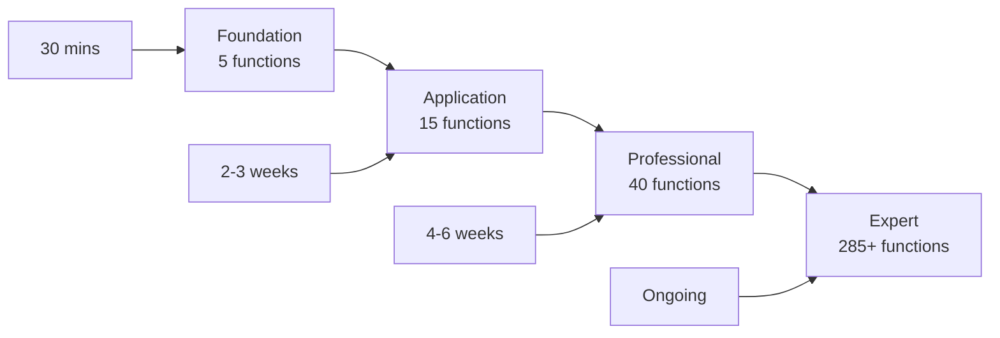

# Learning Advancement Criteria

**Clear milestones and checkpoints to track your Kairo mastery journey.**

## 🎯 Overview

Each learning tier has specific **advancement criteria** that ensure you're ready for the next level. These criteria are based on:

- ✅ **Knowledge comprehension** - Understanding core concepts
- ✅ **Practical application** - Building working examples  
- ✅ **Problem solving** - Handling real-world scenarios
- ✅ **Code quality** - Writing maintainable, error-resilient code

## 📊 Tier Progression



## 🌱 Foundation → Application Advancement

### Prerequisites Check
Before advancing to Application tier, you must demonstrate:

#### Core Knowledge ✅
- [ ] **Result Pattern Mastery**: Can explain when/why to use Result vs exceptions
- [ ] **Schema Understanding**: Can create complex schemas with validation
- [ ] **Pipeline Composition**: Can build multi-step data processing workflows
- [ ] **Error Handling**: Can use `match` to handle all success/failure cases
- [ ] **Functional Thinking**: Understands immutability and pure functions

#### Practical Skills ✅
- [ ] **Built Complete App**: Created working application using all 5 foundation functions
- [ ] **Data Validation**: Implemented form/API validation with clear error messages
- [ ] **Error Recovery**: Handled and displayed validation errors gracefully
- [ ] **Code Organization**: Functions are pure, reusable, and well-named
- [ ] **Testing Mindset**: Can verify each step of pipeline works correctly

#### Assessment Challenge 🧪
**Build a Contact Management System** that:
1. Validates contact data (name, email, phone, address)
2. Transforms data (normalize email, format phone, create display name)
3. Handles validation errors with user-friendly messages
4. Processes multiple contacts and reports success/failure rates

```typescript
// Must use only Foundation functions
import { Result, schema, pipeline, map, match } from 'kairo/beginner'

// Your implementation here...
const contactProcessor = pipeline('contact-processor')
  .input(ContactSchema)
  .map(/* your transformations */)

// Must handle batch processing
const processBatch = async (contacts: any[]) => {
  // Your batch processing logic
}
```

#### Success Criteria ✅
- [ ] All contacts with valid data are processed correctly
- [ ] Invalid contacts are rejected with specific error messages
- [ ] Batch processing reports accurate success/failure statistics
- [ ] Code is readable and follows functional programming principles
- [ ] No exceptions are thrown - all errors handled via Result pattern

---

## ⚡ Application → Professional Advancement

### Prerequisites Check
Before advancing to Professional tier, you must demonstrate:

#### Advanced Knowledge ✅
- [ ] **API Integration**: Can design type-safe API clients with error handling
- [ ] **Data Relationships**: Understands foreign keys, joins, and related data
- [ ] **Business Rules**: Can implement complex validation with async rules
- [ ] **Performance Awareness**: Knows when/how to cache expensive operations
- [ ] **Composition Patterns**: Can choose between pipeline, pipe, and direct calls

#### Production Skills ✅
- [ ] **Complete CRUD App**: Built full application with API, data, and business logic
- [ ] **Relationship Modeling**: Implemented complex data relationships correctly
- [ ] **Async Validation**: Used async rules for database/API validation
- [ ] **Error Resilience**: Graceful degradation when external services fail
- [ ] **Performance Optimization**: Implemented caching for expensive operations

#### Assessment Challenge 🧪
**Build an E-commerce Order System** that:
1. Integrates with external APIs (payment, inventory, shipping)
2. Models complex relationships (users, products, orders, order-items)
3. Implements business rules (inventory checks, price validation, user permissions)
4. Handles failures gracefully (API timeouts, validation errors, insufficient stock)
5. Optimizes performance with caching

```typescript
// Must use Tier 1 functions
import { 
  Result, schema, pipeline, resource, repository,
  hasMany, belongsTo, rule, rules, cache
} from 'kairo/tier1'

// Your implementation must include:
// - Order validation pipeline with business rules
// - Product inventory management with relationships
// - Payment processing with external API integration
// - Error handling for all failure scenarios
// - Caching for product catalog and user data
```

#### Success Criteria ✅
- [ ] Orders process successfully with all validation checks
- [ ] External API failures are handled gracefully
- [ ] Complex business rules are enforced correctly
- [ ] Performance is optimized with appropriate caching
- [ ] Data relationships are modeled and queried efficiently
- [ ] All error scenarios provide meaningful feedback

---

## 🏢 Professional → Expert Advancement

### Prerequisites Check
Before advancing to Expert tier, you must demonstrate:

#### Professional Knowledge ✅
- [ ] **Production Deployment**: Has deployed applications to production
- [ ] **Testing Expertise**: Comprehensive testing strategy with high coverage
- [ ] **Error Monitoring**: Implemented observability and error tracking
- [ ] **Performance Tuning**: Optimized applications for real-world load
- [ ] **Team Collaboration**: Can work with other developers on Kairo projects

#### Enterprise Skills ✅
- [ ] **System Integration**: Connected multiple services and systems
- [ ] **Scaling Patterns**: Handled increased load and complexity
- [ ] **Security Implementation**: Applied security best practices
- [ ] **Documentation Creation**: Created clear documentation for team use
- [ ] **Mentoring Ability**: Can teach Kairo concepts to other developers

#### Assessment Challenge 🧪
**Build a Multi-Tenant SaaS Application** that:
1. Supports multiple organizations with data isolation
2. Integrates with multiple external services (Auth0, Stripe, SendGrid, etc.)
3. Implements role-based permissions and security
4. Handles high load with performance optimizations
5. Includes comprehensive testing and monitoring

```typescript
// Must use Professional patterns
import { 
  // Core Tier 2 functions (enhanced error handling, testing, FP utils)
  Result, enhance, retry, validate, testPipeline, 
  // Extensions as needed
  events, transactions, performance, monitoring
} from 'kairo/tier2'

// Your implementation must demonstrate:
// - Multi-tenant data architecture
// - Advanced error handling and recovery
// - Comprehensive test coverage
// - Performance monitoring and optimization
// - Security and authorization patterns
```

#### Success Criteria ✅
- [ ] Application handles real-world production load
- [ ] Multi-tenancy is implemented securely
- [ ] Comprehensive testing covers all scenarios
- [ ] Monitoring provides actionable insights
- [ ] Documentation enables team onboarding
- [ ] Security best practices are followed

---

## 🎓 Expert Level Specialization

Expert level focuses on **specialization tracks** rather than general advancement:

### Event-Driven Architecture Track
- [ ] Built complex event-sourced systems
- [ ] Implemented CQRS patterns effectively
- [ ] Handled distributed system challenges
- [ ] Created custom event store implementations

### High-Performance Systems Track
- [ ] Optimized for extreme performance requirements
- [ ] Implemented custom caching strategies
- [ ] Built efficient batch processing systems
- [ ] Handled memory and CPU optimization

### Enterprise Integration Track
- [ ] Integrated with legacy enterprise systems
- [ ] Implemented complex business workflows
- [ ] Handled enterprise security requirements
- [ ] Built custom Kairo extensions

### Framework Development Track
- [ ] Created custom Kairo extensions
- [ ] Contributed to Kairo core development
- [ ] Built domain-specific frameworks on Kairo
- [ ] Mentored other framework developers

---

## 📈 Self-Assessment Tools

### Confidence Check
Rate your confidence (1-5) in each area:

#### Foundation Level
- [ ] Result pattern and error handling (1-5)
- [ ] Schema validation and data contracts (1-5) 
- [ ] Pipeline composition and data flow (1-5)
- [ ] Functional programming concepts (1-5)
- [ ] Debugging and troubleshooting (1-5)

#### Application Level  
- [ ] API integration and external services (1-5)
- [ ] Data modeling and relationships (1-5)
- [ ] Business rules and validation (1-5)
- [ ] Performance optimization (1-5)
- [ ] Complex error handling (1-5)

#### Professional Level
- [ ] Production deployment and monitoring (1-5)
- [ ] Testing strategies and coverage (1-5)
- [ ] Team collaboration and code review (1-5)
- [ ] Security and best practices (1-5)
- [ ] Documentation and knowledge sharing (1-5)

### Knowledge Gaps Analysis
For any area rated 3 or below:
1. **Identify specific gap**: What exactly don't you understand?
2. **Find targeted practice**: Which examples/exercises address this?
3. **Seek help**: Where can you get guidance on this topic?
4. **Practice deliberately**: Focus practice time on this specific area

### Readiness Indicators

#### Ready to Advance When:
- ✅ All confidence ratings are 4+ for current tier
- ✅ Assessment challenge completed successfully  
- ✅ Can teach concepts to someone else
- ✅ Can debug problems independently
- ✅ Excited to tackle next tier's challenges

#### Need More Practice When:
- ❌ Any confidence rating below 3
- ❌ Assessment challenge feels overwhelming
- ❌ Struggling to explain concepts clearly
- ❌ Frequently stuck on debugging
- ❌ Not comfortable with current tier complexity

## 🚀 Advancement Actions

### When Ready to Advance:
1. **Complete final assessment** for current tier
2. **Review next tier prerequisites** to understand expectations
3. **Set learning goals** for next tier based on interests
4. **Begin next tier gradually** while reinforcing current knowledge
5. **Celebrate the milestone** - advancement is an achievement!

### When Need More Practice:
1. **Identify specific gaps** using self-assessment tools
2. **Focus on weakest areas** with targeted practice
3. **Build more projects** in current tier to gain confidence
4. **Seek mentorship** or community support for guidance
5. **Be patient** - solid foundations lead to faster future learning

---

**Remember**: Advancement is about **depth of understanding**, not speed of completion. Take the time to truly master each tier before moving forward. This solid foundation will make all future learning faster and more effective! 🎯